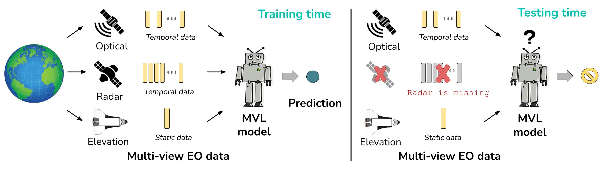

# Impact of missing views in multi-view learning models
<a href="https://github.com/fmenat/mvlearning">    </a> 
[](https://www.arxiv.org/abs/2403.14297v1) 
[](https://doi.org/10.1109/IGARSS53475.2024.10640375)

> Public repository of our work [*Impact assessment of missing data in model predictions for Earth observation applications*](https://doi.org/10.1109/IGARSS53475.2024.10640375)
---



This code assesses the effect of missing views during inference in ML models for Earth Observation (EO) applications.

### Data
Preprocessed data can be accessed at: [Link](https://cloud.dfki.de/owncloud/index.php/s/yxAfArTXkMF7nM2)

### Additional source
We use the following source for multi-view learning: [https://github.com/fmenat/mvlearning](https://github.com/fmenat/mvlearning)

### Training
* To train a single-view learning model (e.g. Input-level fusion):  
```
python train_singleview.py -s config/input.yaml
```

* To train all the views individually with single-view learning (e.g. for single-view predictions or Ensemble-based fusion):  
```
python train_singleview_pool.py -s config/pool.yaml
```

* To train a multi-view learning model (e.g. Feature-level fusion, Decision-level fusion, Gated Fusion, Feature-level fusion with MultiLoss):  
```
python train_multiview.py -s config/mv_feat.yaml
```

* To train a multi-view learning model with CCA searching in case of missing views:  
```
python train_multiview_cca.py -s config/mv_cca.yaml
```

### Evaluation
* To evaluate the model by its predictive quality:
```
python evaluate_predictions.py -s config/evaluation.yaml
```

* To evaluate the model by its predictive robustness:
```
python evaluate_rob_pred.py -s config/evaluation.yaml
```


# 🖊️ Citation and more

Mena, Francisco, et al. "*Impact assessment of missing data in model predictions for Earth observation applications*." IEEE International Geoscience and Remote Sensing Symposiums (IGARSS), 2024.
```bibtex
@inproceedings{mena2024igarss,
  title = {Impact assessment of missing data in model predictions for {Earth} observation applications},
  booktitle = {{IEEE International Geoscience} and {Remote Sensing Symposium} ({IGARSS})},
  author = {Mena, Francisco and Arenas, Diego and Charfuelan, Marcela and Nuske, Marlon and Dengel, Andreas},
  year = {2024},
  publisher = {{IEEE}},
  doi={10.1109/IGARSS53475.2024.10640375}
}
```
> [!NOTE]
> * [Presentation](https://github.com/fmenat/fmenat/blob/main/presentations/2024_IGARSS_Missing.pdf)
